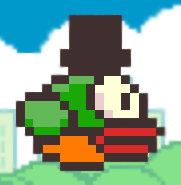

<div align="center">

<h2>Flappy Bird</h2>
</div>


<p align="center">
</p>

<p align="center"><strong>Joc 2D interactiv în C++, făcut de la 0 folosind biblioteca Raylib</strong></p>

---

<h2>Scopul proiectului</h2>
    <p>
        Scopul proiectului este realizarea unui joc 2D de tip arcade, similar cu celebrul joc „Flappy Bird”, unde
        utilizatorul controlează o pasăre care trebuie să evite obstacole verticale (țevi) pentru a acumula puncte.
    </p>
<h2>Limbaj de programare și tehnologii utilizate</h2>
    <ul>
        <li><strong>Limbaj: </strong>C și C++</li>
        <li><strong>Bibliotecă grafică: </strong><a href = "/include/raylib.h">Raylib</a></li>
        <li><strong>Fișiere externe: </strong>CSV, texturi PNG, font TTF</li>
    </ul>
<h2>Funcționalități principale</h2>
    <ul>
        <li>Interfață grafică interactivă cu Raylib</li>
        <li>Mișcare realistă a păsării prin gravitație și zbor</li>
        <li>Coliziuni cu obstacole și marginea ferestrei</li>
        <li>Sistem de scor și salvare în fișier CSV</li>
        <li>Meniu cu butoane animate pentru interacțiune</li>
    </ul>

<h2>Metode de descarcare</h2>
<ol type = "1">
    <li><p>Folosind aplicația Git, urmăriți urmatorii pași:</p></li>
    <ul>
        <li>Clonează repozitoriul folosind comanda:</li></ul>

```sh
git clone https://github.com/Stefix4/Flappy-Bird.git
```
<ul>
    <li>Rulați fișierul Game</li>
    
</ul>
<li><p>Descarcați fișierele în format ZIP, apoi:</p></li>
<ul>
    <li>Extrageți fișierele</li>
    <li>Rulați fișierul Game</li>
    
</ul>
</ol>

---

<h3>Realizatori</h3>
<p></p>
<a href="https://github.com/Stefix4/Flappy-Bird/graphs/contributors">
    
</a>

